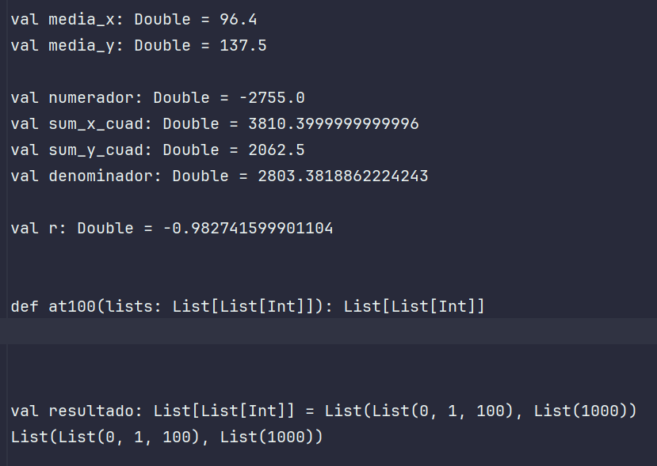

# Taller Grupal  1
## Estructuras de datos (Tuplas, Listas)

**Semana**: 4

**Objetivos**:

- Realizar operaciones con estructuras de datos (tuplas, listas).

### Descripción:

Formará grupos, por afinidad, de 4 integrantes. Cada grupo debe designar a un integrante como su líder que será el encargado de: organizar el grupo garantizando el trabajo de los demás integrantes, será el único que podrá plantear preguntas al tutor y sobretodo debe garantizar que todos comprenden el problema y la solución. Si el grupo lo considera necesario podrán cambiar de líder cuantas veces lo crean necesario.

### Ejercicio 1

Elabore un programa en Scala que a través de los principios de programación funcional resuelva el siguiente problema.

Calcular el coeficiente de correlación de Pearson para establecer si existe una relación entre el peso de una persona y su tensión sistólica.

| Peso (kg) | Tensión sistólica |
|-----------|--------------------|
| 72        | 160                |
| 76        | 155                |
| 78        | 150                |
| 81        | 145                |
| 89        | 140                |
| 95        | 135                |
| 108       | 130                |
| 115       | 125                |
| 120       | 120                |
| 130       | 115                |


> Defina una lista de tuplas para la colección de datos. 


### Fórmulas

1. **Fórmula general del coeficiente de correlación de Pearson**:

$$
r = \frac{\sum_{i=1}^{n} (x_i - \overline{x})(y_i - \overline{y})}{\sqrt{\sum_{i=1}^{n} (x_i - \overline{x})^2} \sqrt{\sum_{i=1}^{n} (y_i - \overline{y})^2}}
$$

2. **Cálculo de la media de \(x\) e \(y\)**:
   
$$
\overline{x} = \frac{\sum_{i=1}^{n} x_i}{n} \quad \text{y} \quad \overline{y} = \frac{\sum_{i=1}^{n} y_i}{n}
$$

**Donde**:
- \(n\) es el número total de observaciones en las listas de datos \(x\) e \(y\).

```scala
val tabla = List(
  (72,160),
  (76,155),
  (78,150),
  (81,145),
  (89,140),
  (95,135),
  (108,130),
  (115,125),
  (120,120),
  (130,115)
)
val media_x = tabla.map(_._1).sum.toDouble/tabla.map(_._1).length
val media_y = tabla.map(_._2).sum.toDouble/tabla.map(_._2).length

val numerador = tabla.map(row => (row._1 - media_x)*(row._2-media_y)).sum
val sum_x_cuad = tabla.map(row => Math.pow(row._1 - media_x,2)).sum
val sum_y_cuad = tabla.map(row => Math.pow(row._2 - media_y,2)).sum
val denominador = Math.sqrt(sum_x_cuad) * Math.sqrt(sum_y_cuad)

val r = numerador / denominador
```

### Información para la interpretación de los resultados
> El coeficiente de correlación de Pearson (\(r\)) es una medida estadística que indica la fuerza y la dirección de la relación lineal entre dos variables. Es útil para determinar si un cambio en una variable se asocia con un cambio en la otra y qué tan fuerte es esa relación. Los valores de \(r\) van de -1 a 1.

#### Posibles casos para interpretar el coeficiente de correlación:

$$
\begin{array}{l}
r = 1: \text{ Correlación positiva perfecta.} \\
0.7 \leq r < 1: \text{ Correlación positiva fuerte.} \\
0.4 \leq r < 0.7: \text{ Correlación positiva moderada.} \\
0.1 \leq r < 0.4: \text{ Correlación positiva débil.} \\
r = 0: \text{ No hay correlación lineal.} \\
-0.4 < r \leq -0.1 : \text{ Correlación negativa débil.} \\
-0.7 < r \leq -0.4: \text{ Correlación negativa moderada.} \\
-1 < r \leq -0.7: \text{ Correlación negativa fuerte.} \\
r = -1: \text{ Correlación negativa perfecta.}
\end{array}
$$

### Preguntas a resolver
1. ¿El coeficiente de correlación es positivo o negativo?
Rta: El coeficiente es negativo y es -0.98.
2. ¿Qué se puede concluir sobre la relación entre el peso y la tensión sistólica basándose en el coeficiente de correlación?
Rta: Que tienen una correlación casi igual a -1, es decir, es casi una correlación negativa perfecta, lo que significa que los valores son inversamente proporcionales.
3. Explique detalladamente lo que sucede en la línea de código donde se calcula el numerador y el denominador de la fórmula del coeficiente de correlación de Pearson.
Rta: Para calcular el numerador primero mapeamos la tabla y usamos row para poder acceder a la fila, el _1 corresponde a x y _2 correspondría a y, se restan con su promedio/media correspondiente, se multiplican sus diferencias y se van sumando. 
4. ¿Qué salida se esperaría si el coeficiente de correlación es calculado con datos donde la tensión sistólica aumenta a medida que el peso disminuye?
Rta: La relacion sería la misma, inversamente proporcional

### Ejercicio 2
Definir una función `at100` de tipo `List[List[Int]]` que devuelve un dato de tipo `List[List[Int]]`, seleccionando solo aquellas listas internas cuyo valor más grande sea al menos 100.

```Scala
def at100(lists: List[List[Int]]): List[List[Int]] = {
   lists.filter(row => row.max >= 100) // linea de respuesta
}

// Prueba de la función
val resultado = at100(List(List(0, 1, 100), List(60, 80), List(1000)))
println(resultado) // Salida esperada: List(List(0, 1, 100), List(1000))
```



### Calificación:

Para la calificación, se debe presentar el trabajo realizado a su tutor. Es necesario recalcar que la presentación se hace una única vez, no existe la posibilidad de presentaciones adicionales con correcciones. 

Tal como se le explicó anteriormente, los talleres se calificarán de la siguiente manera:

- 10 puntos si presenta en el horario de prácticas y experimentación.
- 7 puntos si presenta en el horario de tutoría

La hora máxima de presentación será las 09h20